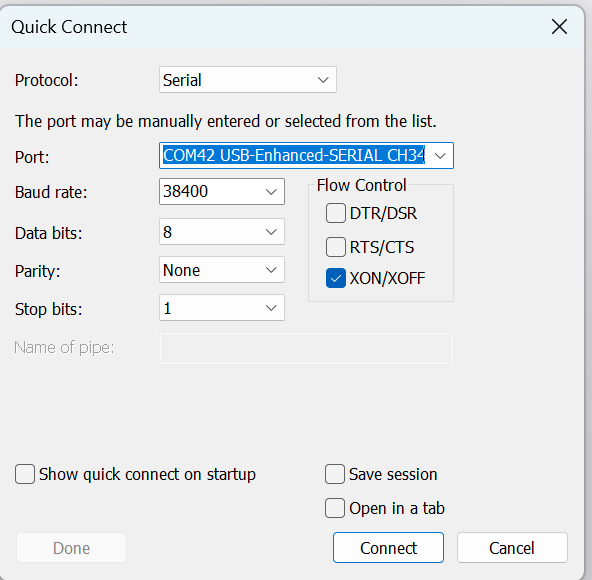
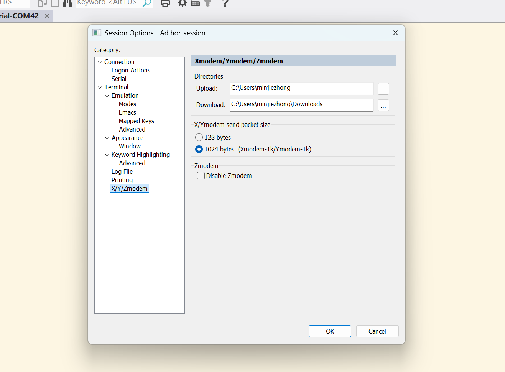
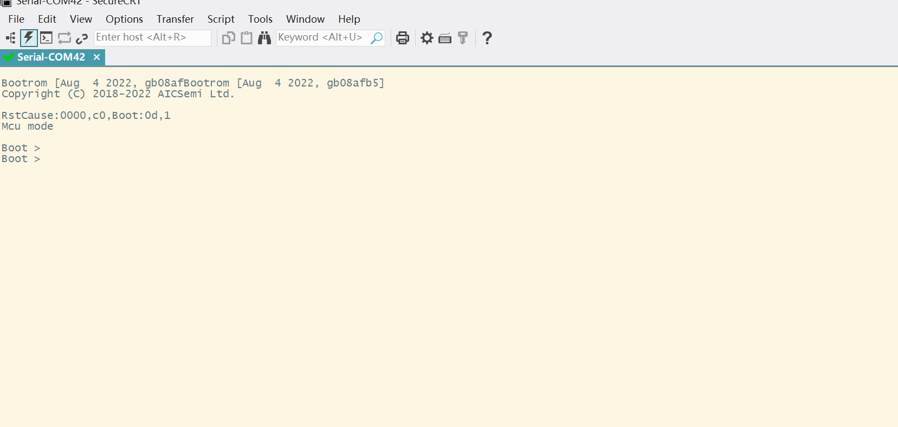
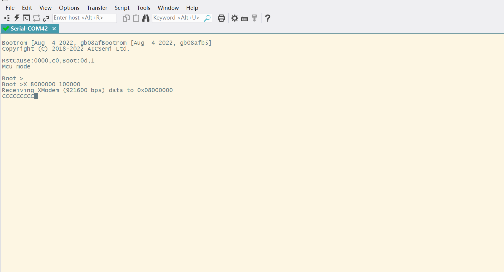
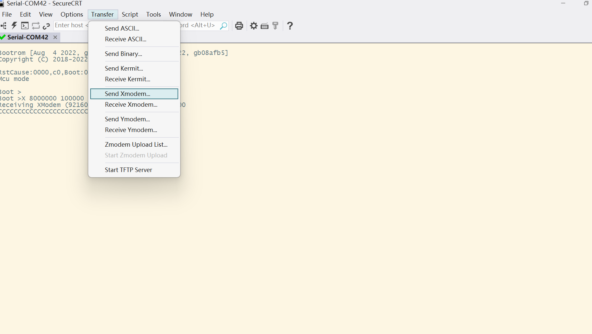
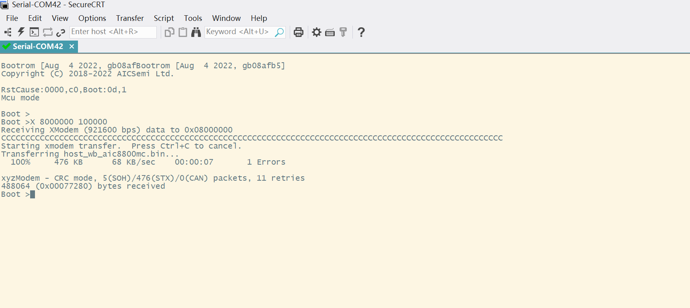
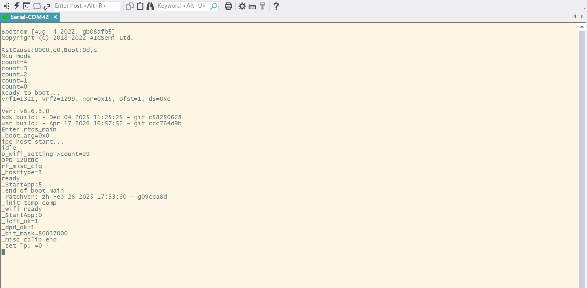

# AIC8800MC Wi-Fi 使用说明

## 准备工作
该固件是基于aic8800mc-sdk 6.6.3.0版本编译的，SHA：`256e2923bbf32483f394c5f9e5dc2f275a733ba3` ，[aic8800mc-sdk](http://git.aicsemi.com/AICSemi/aic8800-sdk)
wifi固件位置：aic8800mc\host_wb_aic8800mc.bin

执行烧入wifi固件前需要先保持wifi模组的供电正常，否则会导致进入boot失败。
wifi模组供电要求：PORON(IN)输入3.3V、VDDIO(IN)输入3.3V

如果使用SF32开发板进行wifi固件烧入，需要先将SF32程序下载到开发板，并运行，然后进行wifi固件烧入。
**解释：** SF32程序中有对wifi模组供电IO的配置，如果没有提前下载开发板固件的并运行的话，会导致wifi模组供电异常,最终进入boot模式失败。

* 需要下载烧入工具SecureCRT，可以通过[SecureCRT下载](https://www.vandyke.com/download/index.html)
* 通过串口连接Demo板Trace串口，建议先确认串口号和串口驱动正常

## wifi固件烧入步骤
* 安装好工具SecureCRT后，打开软件进行配置，波特率 921600，设置 Xmodem-1k 模式。若在打开串口情况下进行设置，则需重新打开串口，使软件串口配置生效




* 将HST_WAKE_WL(IN)和TMS（BT_WAKE_HOST）接地，按下板子的复位按键，进入boot模式。



* 启动文件传输，键入命令 x ADDRESS LENGTH（例如x 12000000 60000）。第一个参数是程序启动地址（16进制），第二个参数是擦除长度（Byte，16进制，通常为bin文件长度按4KB向上取整）。
	* 擦除长度计算：erase_len = ((bin_size + 4095) / 4096) * 4096
	* 示例：烧入固件时输入`x 8000000 100000`



* 上传文件如上图 SecureCRT 软件启动传输之后会持续打印 C 字符，此时通过菜单栏，Transfer->Send Xmodem，选择对应的 bin 文件即可传输




* 运行wifi固件代码：去除 Boot Mode 短接，按下开发板的RST按键，芯片重新上电


## 常见问题
**注意：** 如果进入boot模式打印"boot abort: -1"，需要执行以下命令给wifi芯片断电之后，再执行烧入的操作
```
f 1 3 1 2 1
f 3
```

* 串口无输出或没有持续打印 C 字符：检查供电、Boot短接、串口号/波特率是否正确
* Xmodem 传输失败：确认选择的是 Xmodem-1k，bin文件路径是否正确

## WiFi调试命令
主控芯片wifi驱动调试命令（通过主控串口发送）
* wifi_test wifi_on：进行初始化操作，包括sdio寻卡、设置mac地址，初始化wifi
* wifi_test scan：扫描wifi
* wifi_test connect [ssid] [password]：进行wifi连接操作
* ping [ip]/[dns] ：ping测试，验证网络是否正常
* weather ：查询天气，验证get http请求是否正常

wifi芯片固件调试命令（通过wifi串口发送）
* wifi_on <1/0>：wifi开关控制
* scan <1/0>：wifi扫描
* connect <1/0> [ssid] [password]：wifi连接
* disconnect：wifi断开连接

