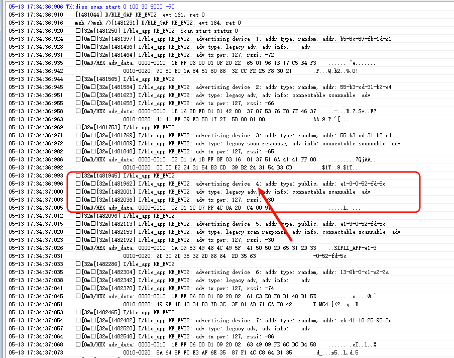
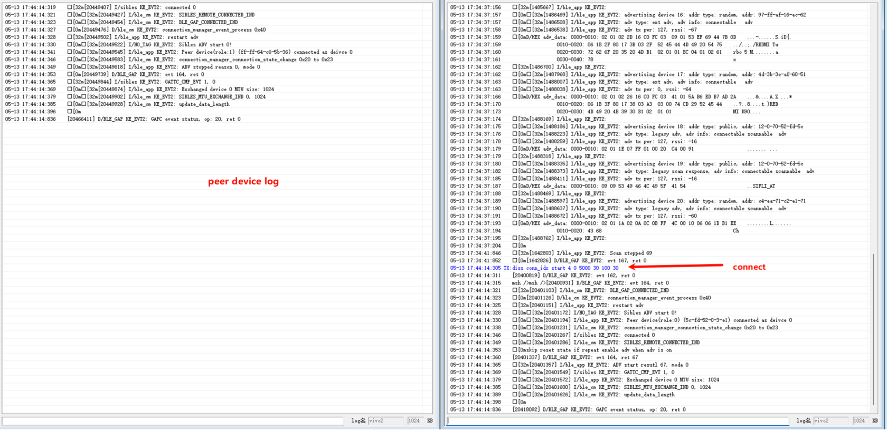
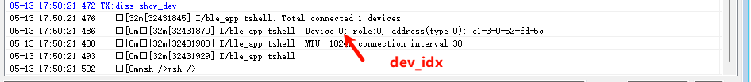
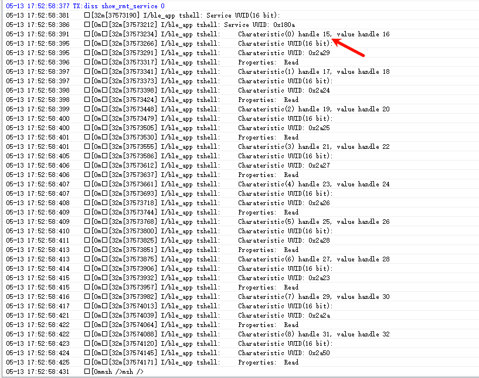
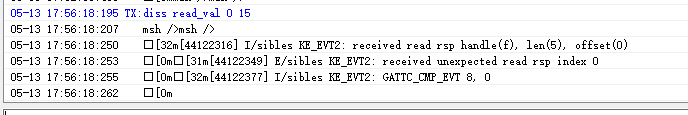
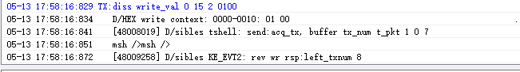

# BLE multi_connection示例

源码路径：example/ble/multi_connection

## 支持的平台
<!-- 支持哪些平台 -->
全平台

## 概述
本例程演示了本平台基于GAP central 和 peripheral和GATT server，展示了BLE多连接的示例

## 例程的使用
1. 作为从设备时开机会自动开启广播，可以通过手机的BLE APP进行连接。
2. 连接之后，板子会自动再次打开广播，可以再使用其他的手机进行连接
3. 也可以作为主设备，通过Finsh命令搜索连接其他从设备，操作步骤如下：

#### 步骤一：扫描周围设备
在串口终端输入以下命令开始扫描周围BLE设备：
```
diss scan start 0 100 30 5000 -90
```
参数说明（按顺序）：
| 参数 | 示例值 | 说明 |
|:-----|:-------|:-----|
| dup | 0 | 重复过滤策略，0=不过滤重复广播，1=过滤重复广播 |
| interval | 100 | 扫描间隔（单位：ms） |
| window | 30 | 扫描窗口（单位：ms） |
| duration | 5000 | 扫描持续时间（单位：ms），到时间后自动停止 |
| rssi | -90 | RSSI过滤阈值（单位：dBm），信号弱于此值的设备不显示 |

扫描结果会在串口打印，每个设备会显示设备编号、地址类型、MAC地址、广播类型和RSSI等信息。

如需提前停止扫描，输入：
```
diss scan stop
```

#### 步骤二：发起连接
根据扫描到的设备编号发起连接，例如：如下图我们扫描到了一堆设备，我们想要连接的设备的idx为4，那我们发起的连接命令为：
```
diss conn_idx start 4 0 5000 30 100 30
```


参数说明（按顺序）：
| 参数 | 示例值 | 说明 |

|:-----|:-------|:-----|
| idx | 1 | 扫描结果中的设备编号（从1开始） |
| own_addr_type | 0 | 本机地址类型，0=Public/Random Static，1=Resolvable |
| super_timeout | 5000 | 连接超时时间（单位：ms） |
| conn_itv | 30 | 连接间隔（单位：ms） |
| scan_itv | 100 | 连接扫描间隔（单位：ms） |
| scan_wd | 30 | 连接扫描窗口（单位：ms） |

连接成功后对端设备也会打印连接信息：



#### 步骤三：连接后操作
连接成功后，可以使用以下命令进行后续操作：

**查看已连接设备列表：**
```
diss show_dev
```



dev_idx 是“已连接设备的索引号”。
执行 diss show_dev 后，会列出当前连接的设备并给出编号（通常从 0 开始），这个编号就是 dev_idx，后续命令都用它来指定对哪一台已连接设备操作。

**搜索远端GATT服务：**
```
diss search_svc <dev_idx> <uuid_len> <uuid_hex>
```
例如搜索16-bit UUID为0x180A的服务：`diss search_svc 0 2 0A18`

**显示搜索到的服务详情：**
```
diss show_rmt_service <dev_idx>
```


handle 是 GATT 里的“属性句柄”，后面的命令需要用到

**读取远端特征值：**
```
diss read_val <dev_idx> <handle>
```


**写入远端特征值：**
```
diss write_val <dev_idx> <handle> <data_len> <data_hex>
```
例如向设备0的handle 15写入2字节数据：

```
diss write_val 0 15 2 0100
```



### 硬件需求
运行该例程前，需要准备：
+ 一块本例程支持的开发板([支持的平台](#Platform_peri))。
+ 手机设备。

### menuconfig配置
1. 使能蓝牙(`BLUETOOTH`)：
    - 路径：Sifli middleware → Bluetooth
    - 开启：Enable bluetooth
        - 宏开关：`CONFIG_BLUETOOTH`
        - 作用：使能蓝牙功能
2. 使能GAP, GATT Client, BLE connection manager：
    - 路径：Sifli middleware → Bluetooth → Bluetooth service → BLE service
    - 开启：Enable BLE GAP central role
        - 宏开关：`CONFIG_BLE_GAP_CENTRAL`
        - 作用：作为BLE CENTRAL（中心设备）的开关，打开后，提供扫描和主动发起与外设（Peripheral）的连接功能。
    - 开启：Enable BLE GATT client
        - 宏开关：`CONFIG_BLE_GATT_CLIENT`
        - 作用：GATT CLIENT的开关，打开后，可以主动搜索发现服务，读/写数据，接收通知。
    - 开启：Enable BLE connection manager
        - 宏开关：`CONFIG_BSP_BLE_CONNECTION_MANAGER`
        - 作用：提供BLE连接控制管理，包括多连接管理，BLE配对，链路连接参数更新等内容。
3. 使能NVDS：
    - 路径：Sifli middleware → Bluetooth → Bluetooth service → Common service
    - 开启：Enable NVDS synchronous
        - 宏开关：`CONFIG_BSP_BLE_NVDS_SYNC`
        - 作用：蓝牙NVDS同步。当蓝牙被配置到HCPU时，BLE NVDS可以同步访问，打开该选项；蓝牙被配置到LCPU时，需要关闭该选项。

### 编译和烧录
切换到例程project/common目录，运行scons命令执行编译：
```c
> scons --board=eh-lb525 -j8
```
切换到例程`project/common/build_xx`目录，运行`uart_download.bat`，按提示选择端口即可进行下载：
```c
$ ./uart_download.bat

     Uart Download

please input the serial port num:5
```
关于编译、下载的详细步骤，请参考[快速入门](/quickstart/get-started.md)的相关介绍。

## 例程的预期结果
<!-- 说明例程运行结果，比如哪几个灯会亮，会打印哪些log，以便用户判断例程是否正常运行，运行结果可以结合代码分步骤说明 -->
例程启动后：
1. 可以被若干个不同手机，通过BLE APP搜到并连接，进行相应的GATT特质值read/write等操作。
2. 可以主动连接其他设备

## 异常诊断


## 参考文档
<!-- 对于rt_device的示例，rt-thread官网文档提供的较详细说明，可以在这里添加网页链接，例如，参考RT-Thread的[RTC文档](https://www.rt-thread.org/document/site/#/rt-thread-version/rt-thread-standard/programming-manual/device/rtc/rtc) -->

## 更新记录
| 版本  | 日期    | 发布说明 |
| :---- | :------ | :------- |
| 0.0.1 | 02/2025 | 初始版本 |
|       |         |          |
|       |         |          |