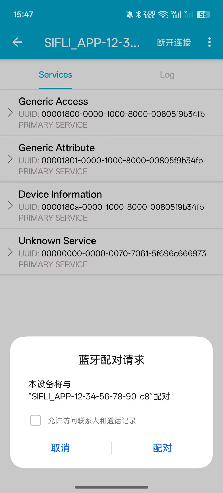
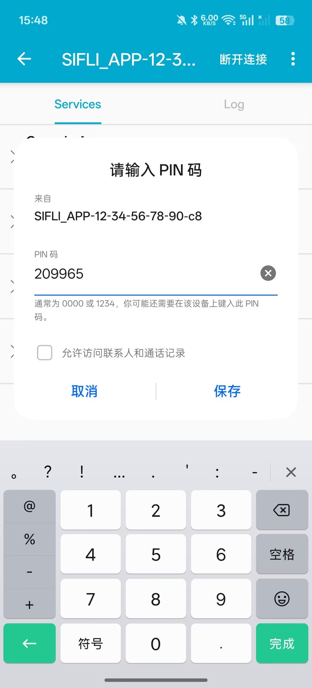
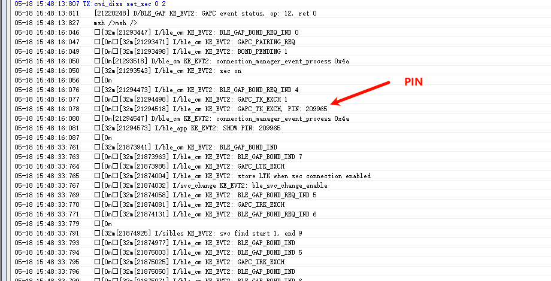
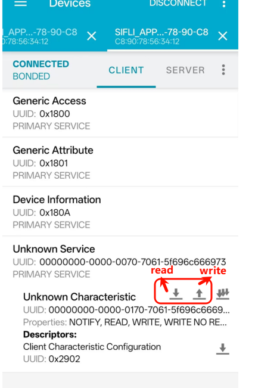

# BLE Pair Example

Source path: example/ble/pair

(Platform_peri)=
## Supported Platforms
<!-- Supported boards and chip platforms -->
All platforms

## Overview
<!-- Example overview -->
This example shows how to use GAP peripheral pairing on this platform.


## How to Use
<!-- Explain how to use the example, such as which pins to observe. Compilation and flashing can reference other docs.
For rt_device examples, list the required config switches, e.g., PWM examples need PWM1 enabled. -->

This example acts as a BLE Peripheral, starts advertising on boot, and supports pairing. You can use a mobile BLE app to complete pairing and verify GATT read/write.

### Procedure
1. Power on the device. It starts advertising automatically. The name format is `SIFLI_APP-xx-xx-xx-xx-xx-xx`.
2. Use a mobile BLE app to scan and connect.
3. After connection, send `cmd_diss set_sec xx xx` to trigger pairing. For example:
```
cmd_diss set_sec 0 2
```
- Parameter note: `0` is the connection index `conn_idx` (usually 0 for a single connection).
`2` is the security level (LE_SECURITY_LEVEL_NO_MITM_BOND: bonding without MITM).
After sending the command, the phone shows a pairing request.



Tap Pair. The phone asks for a PIN. Enter the PIN shown in the device log to complete pairing.





4. After connecting, use the BLE app to perform GATT read/write tests:
    - Read: returns 4 bytes (little-endian).
    - Write: supports 1 to 4 bytes. The UART log prints the new value.




### Hardware Requirements
Before running this example, prepare:
+ A development board supported by this example ([Supported Platforms](#Platform_peri)).
+ A mobile phone.

### menuconfig Settings
1. Enable Bluetooth (`BLUETOOTH`):
    - Path: Sifli middleware → Bluetooth
    - Enable: Enable bluetooth
        - Macro: `CONFIG_BLUETOOTH`
        - Purpose: Enables Bluetooth.
2. Enable GAP, GATT Client, BLE connection manager:
    - Path: Sifli middleware → Bluetooth → Bluetooth service → BLE service
    - Enable: Enable BLE GAP central role
        - Macro: `CONFIG_BLE_GAP_CENTRAL`
        - Purpose: Enables BLE CENTRAL role (scan and initiate connections).
    - Enable: Enable BLE GATT client
        - Macro: `CONFIG_BLE_GATT_CLIENT`
        - Purpose: Enables GATT CLIENT for service discovery, read/write, and notifications.
    - Enable: Enable BLE connection manager
        - Macro: `CONFIG_BSP_BLE_CONNECTION_MANAGER`
        - Purpose: Enables BLE connection management (multi-connection, pairing, connection parameter updates).
3. Enable NVDS:
    - Path: Sifli middleware → Bluetooth → Bluetooth service → Common service
    - Enable: Enable NVDS synchronous
        - Macro: `CONFIG_BSP_BLE_NVDS_SYNC`
        - Purpose: BLE NVDS sync access. Enable when BLE runs on HCPU; disable when BLE runs on LCPU.

### Build and Flash
Switch to the example project directory and build with scons:
```c
> scons --board=eh-lb525 -j32
```
Switch to the example `project/build_xx` directory, run `uart_download.bat`, and follow the prompt to select the port:
```c
$ ./uart_download.bat

     Uart Download

please input the serial port num:5
```
For detailed build and download steps, refer to [Quick Start](/quickstart/get-started.md).

## Expected Results
1. On power-up, the UART prints `receive BLE power on!` and advertising starts.
2. The phone can discover and connect. The log shows `Peer device(xx-xx-xx-xx-xx-xx) connected`.
3. When pairing is triggered, the log prints `SHOW PIN` or `SHOW NC`, and the connection remains after pairing.
4. During GATT read/write tests, the log prints `Updated app value from:xx to:xx`.


## Troubleshooting


## References
<!-- For rt_device examples, RT-Thread provides detailed docs. Add links here if needed. -->

## Revision History
| Version | Date | Notes |
|:---|:---|:---|
|0.0.1 |01/2025 |Initial version |
| | | |
| | | |
