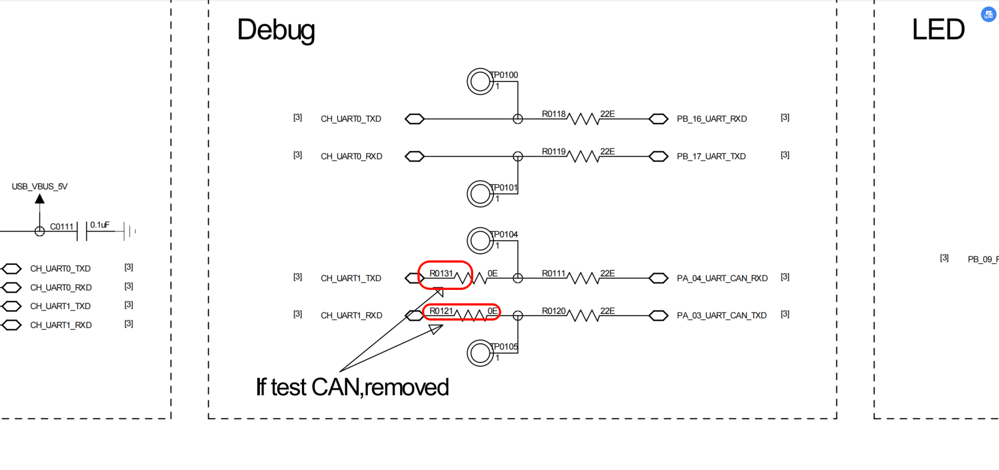
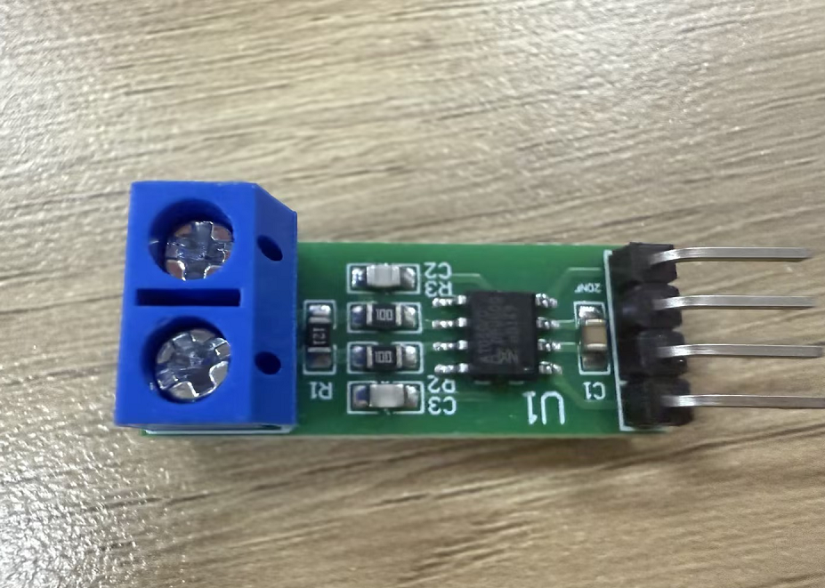
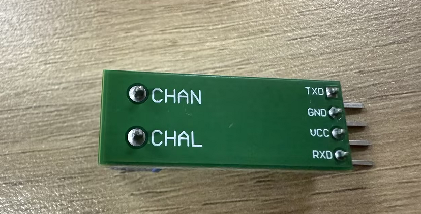
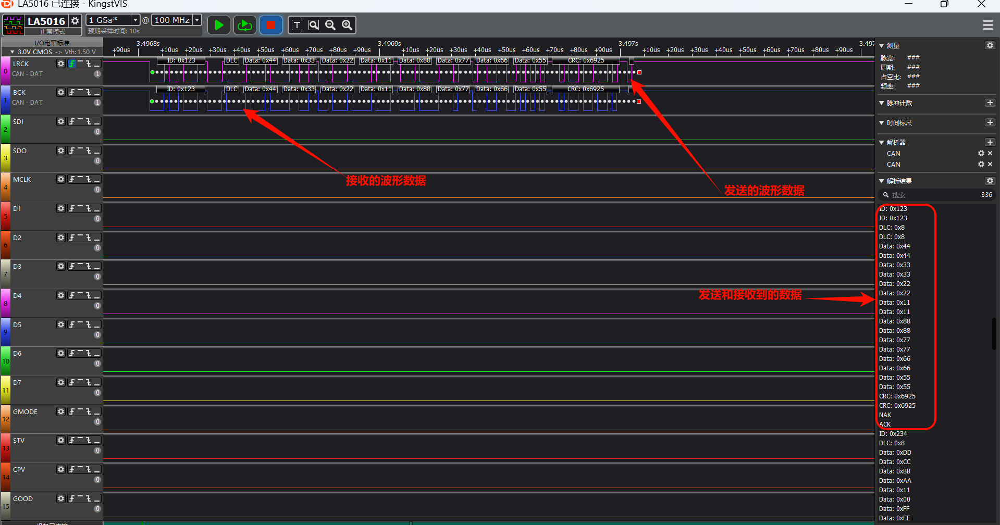

# CAN 示例

源码路径: example/hal/can

## 支持的平台
例程可以运行在以下开发板上.
* sf32lb56-lcd

## 概述
* 本例程演示了如何使用芯片的CAN控制器完成CAN通信功能.
* 两个开发板之间进行CAN通信，实现数据收发功能。

## 硬件要求
- 支持CAN功能的SiFli开发板（如sf32lb56-lcd或sf32lb58-lcd）
- 两个CAN收发器模块（如TJA1050）
- 至少两个开发板用于测试双向通信
- 杜邦线若干

## 硬件连接
* 使用CAN通信之前需要先将板子上的这两个电阻移除，具体位置可以参考下图



开发板 | CAN收发器 |
--|--
PA03（8） | TX 
PA04（9） | RX
5V(4)     | VCC
GND(6)    | GND

CAN收发器 | CAN收发器
--|--
CHAN  | CHAN 
CHAL  | CHAL

* CAN收发器（TJA1050）




### 编译和烧录
* 分别编译烧录can_tx和can_rx两个工程到对应的板子
* 切换到例程project目录，运行scons命令执行编译：
```
scons --board=sf32lb56-lcd_a128r12n1 -j32
```
`build_sf32lb56-lcd_a128r12n1_hcpu\download.bat`，程序通过JLink自动下载：
```
build_sf32lb56-lcd_a128r12n1_hcpu/uart_download.bat(串口下载)
```

## 示例输出
如果示例运行成功，您将在串口看到以下输出：

* can_rx的log输出
```
                        
                       \ | /
01-13 17:07:26:864    - SiFli Corporation
01-13 17:07:26:865     / | \     build on Dec 25 2025, 2.4.0 build befba178
01-13 17:07:26:868     2020 - 2022 Copyright by SiFli team
01-13 17:07:26:869    mount /dev sucess
01-13 17:07:26:873    [I/drv.audprc] init 00 ADC_PATH_CFG0 0x924
01-13 17:07:26:874    [I/drv.audprc] HAL_AUDPRC_Init res 0
01-13 17:07:26:877    [I/drv] HAL_AUDCODEC_Init res 0
01-13 17:07:26:878    [I/TOUCH] Regist touch screen driver, probe=1001aa4d 
01-13 17:07:26:882    call par CFG1(35bb)
01-13 17:07:26:883    fc 9, xtal 2000, pll 2038
01-13 17:07:26:887    call par CFG1(35bb)
01-13 17:07:26:889    fc 9, xtal 2000, pll 2038
01-13 17:07:26:890    CAN 2.0 start test
01-13 17:07:26:893    This board operates as the receiving end.
01-13 17:07:26:894    Switch to receiving mode and wait for data...
01-13 17:07:26:895    Received data: ID=0x123, DLC=8, Data: 0x11223344, 0x55667788
01-13 17:07:26:903    msh />
01-13 17:07:27:347    Send successful: ID=0x234, Data=0xAABBCCDD 0xEEFF0011 
01-13 17:07:27:846    Switch to receiving mode and wait for data...
01-13 17:07:27:851    Received data: ID=0x123, DLC=8, Data: 0x11223344, 0x55667788
01-13 17:07:28:347    Send successful: ID=0x234, Data=0xAABBCCDD 0xEEFF0011 
01-13 17:07:28:848    Switch to receiving mode and wait for data...
01-13 17:07:28:850    Received data: ID=0x123, DLC=8, Data: 0x11223344, 0x55667788
01-13 17:07:29:349    Send successful: ID=0x234, Data=0xAABBCCDD 0xEEFF0011 
01-13 17:07:29:849    Switch to receiving mode and wait for data...
01-13 17:07:29:850    Received data: ID=0x123, DLC=8, Data: 0x11223344, 0x55667788
01-13 17:07:30:350    Send successful: ID=0x234, Data=0xAABBCCDD 0xEEFF0011 
01-13 17:07:30:849    Switch to receiving mode and wait 
```
* can_tx的log输出
```
01-13 17:07:26:527     \ | /
01-13 17:07:26:530    - SiFli Corporation
01-13 17:07:26:532     / | \     build on Dec 25 2025, 2.4.0 build befba178
01-13 17:07:26:536     2020 - 2022 Copyright by SiFli team
01-13 17:07:26:539    mount /dev sucess
01-13 17:07:26:542    [I/drv.audprc] init 00 ADC_PATH_CFG0 0x924
01-13 17:07:26:546    [I/drv.audprc] HAL_AUDPRC_Init res 0
01-13 17:07:26:548    [I/drv] HAL_AUDCODEC_Init res 0
01-13 17:07:26:550    [I/TOUCH] Regist touch screen driver, probe=1001aa51 
01-13 17:07:26:552    call par CFG1(35bb)
01-13 17:07:26:553    fc 9, xtal 2000, pll 2026
01-13 17:07:26:555    call par CFG1(35bb)
01-13 17:07:26:556    fc 9, xtal 2000, pll 2026
01-13 17:07:26:557    CAN 2.0 start test.
01-13 17:07:26:558    This board operates as the sending end.
01-13 17:07:26:559    Send successful: ID=0x123, Data=0x11223344 0x55667788 
01-13 17:07:27:017    Switch to receiving mode and wait for data...
01-13 17:07:27:023    Received data: ID=0x123, DLC=0, Data: 0x11223344, 0x55667788
01-13 17:07:27:519    Send successful: ID=0x123, Data=0x11223344 0x55667788 
01-13 17:07:28:020    Switch to receiving mode and wait for data...
01-13 17:07:28:022    Received data: ID=0x234, DLC=8, Data: 0xAABBCCDD, 0xEEFF0011
01-13 17:07:28:521    Send successful: ID=0x123, Data=0x11223344 0x55667788 
01-13 17:07:29:022    Switch to receiving mode and wait for data...
01-13 17:07:29:024    Received data: ID=0x234, DLC=8, Data: 0xAABBCCDD, 0xEEFF0011
01-13 17:07:29:523    Send successful: ID=0x123, Data=0x11223344 0x55667788 
01-13 17:07:30:024    Switch to receiving mode and wait for data...
```
### CAN读写波形
* CAN通信波形



### CANC参数修改
```c
static void CAN_Config(void)
{
  /* Initialize parameters */
  hcan.Instance = CAN1; 
  hcan.Init.Prescaler = 0x0b0b;        //Baud rate prescaler,1/48MHz/（11+1）=0.25us。1/(0.25us*10) = 400kbps
  
  /* Initialize CAN peripheral */
  if (HAL_CAN_Init(&hcan) != HAL_OK)
  {
    rt_kprintf("CAN initialization failed.\n");
    Error_Handler();
  }
  
  /* Configure CAN filter */
  CAN_FilterTypeDef can_filter_config;
  
  // Configure standard frame filter (ID=0x123)
  can_filter_config.FilterId = 0x123;
  can_filter_config.FilterMask = 0x7FF; // Exact match for standard ID
  can_filter_config.FilterBank = 0;
  can_filter_config.FilterActivation = ENABLE;
  can_filter_config.IDECheckEnable = ENABLE;
  can_filter_config.IDEValue = CAN_ID_STD; // Only accept standard frames  
  if (HAL_CAN_ConfigFilter(&hcan, &can_filter_config) != HAL_OK)//Configure filter
  {
    rt_kprintf("Failed to configure CAN filter.\n");
    Error_Handler();
  }
}
```
* 首先需要配置预分频为400kbps
* 接下来配置过滤器，`can_filter_config.FilterId`接收ID为：0x123的数据帧
* 通过`can_filter_config.FilterMask`，来为过滤器数据帧进行过滤（0x7FF是标准帧掩码，0x1FFFFFFF扩展帧掩码）
* 通过`can_filter_config.FilterBank`,来配置过滤器编号（0~15）
* 通过`can_filter_config.FilterActivation`，来控制过滤器是否启用
* 通过`can_filter_config.IDECheckEnable`,用于控制IDE检测，通过IDE可以判断是否是扩展帧
* 通过`can_filter_config.IDEValue`,用来控制接收数据帧还是扩展帧

## 异常诊断
* 如果跟log打印不一致或者波形不一致，请检查以下内容：
    1. 检查硬件接线是否正确，是否跟上述说明的接线是一致
    2. 检查uart上的电阻是否去掉 

如有问题，请在GitHub上提出[issue](https://github.com/OpenSiFli/SiFli-SDK/issues)。

## 参考文档
- [SiFli-SDK 快速入门](https://docs.sifli.com/projects/sdk/latest/sf32lb52x/quickstart/index.html)
- [SiFli-SDK 开发指南](https://docs.sifli.com/projects/sdk/latest/sf32lb52x/development/index.html)
