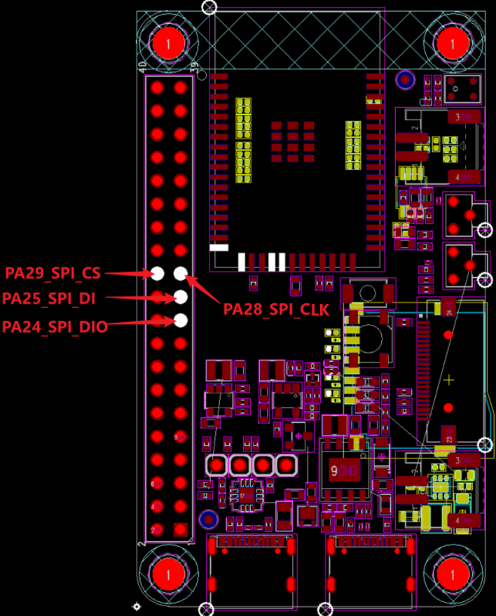
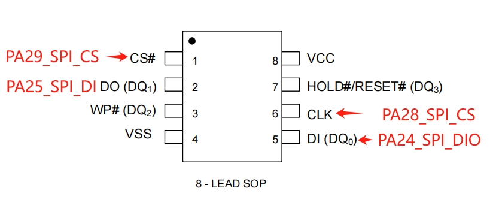

# SPI DMA循环收发示例
源码路径: `example/hal/spi_dma`

## 支持的平台
例程可运行在以下开发板：
- sf32lb52-lcd_n16r8
- sf32lb58-lcd_n16r64n4

## 概述
该例程演示 SPI HAL 在 **DMA环形模式（Circular）** 下的持续收发：
- SPI1 主模式，`2Lines`，8bit，默认 `SPI MODE0`
- TX DMA + RX DMA 同时工作，持续触发时钟并循环搬运数据
- 通过 DMA 半满/全满回调统计运行状态
- 通过错误回调统计异常并打印错误码

本示例重点是验证“DMA循环链路是否稳定”，不是阻塞方式读 NOR ID。

## 例程的使用

### 编译和烧录
#### 以 sf32lb52-lcd_n16r8 开发板为例
* 切换到例程project目录，运行scons命令执行编译对应命令：
```
scons --board=sf32lb52-lcd_n16r8 -j8
```
```
运行`build_sf32lb52-lcd_n16r8_hcpu\uart_download.bat`，按提示选择端口即可进行下载：
> build_sf32lb52-lcd_n16r8_hcpu\uart_download.bat

     Uart Download

please input the serial port num:5
```
关于编译、下载的详细步骤，请参考[](/quickstart/get-started.md)的相关介绍。

在 `project/proj.conf` 中打开 SPI1 DMA 相关开关：

```
CONFIG_BSP_SPI1_TX_USING_DMA=y
CONFIG_BSP_SPI1_RX_USING_DMA=y
```

### 硬件连接

- 仅短接 `MOSI(DIO/DO)` 与 `MISO(DI)`
- `CLK`、`CS` 保持正常输出，不需要再接外部从设备

也可连接真实从设备（另一块板 SPI Slave），此时按标准四线连接并共地。

```{eval-rst}
+--------------+----------+---------------+---------------------+
| 开发板       | 功能引脚 | 信号          | 物理引脚（CONN2）   |
+==============+==========+===============+=====================+
| sf32lb52-lcd | PA_24    | SPI1_MOSI(DIO)| 19                  |
+              +----------+---------------+---------------------+
|              | PA_25    | SPI1_MISO(DI) | 21                  |
+              +----------+---------------+---------------------+
|              | PA_28    | SPI1_CLK      | 23                  |
+              +----------+---------------+---------------------+
|              | PA_29    | SPI1_CS       | 24                  |
+--------------+----------+---------------+---------------------+
| sf32lb58-lcd | PA_21    | SPI1_MOSI(DO) | 8                   |
+              +----------+---------------+---------------------+
|              | PA_20    | SPI1_MISO(DI) | 10                  |
+              +----------+---------------+---------------------+
|              | PA_28    | SPI1_CLK      | 5                   |
+              +----------+---------------+---------------------+
|              | PA_29    | SPI1_CS       | 3                   |
+--------------+----------+---------------+---------------------+
```
sf32lb52-lcd_n16r8硬件原理图参考如下图：


#### 例程输出结果展示:

### 启动日志
```text
Start spi dma circular demo!
spi dma running, tx/rx circular started.
tip: short SPI1 MOSI(DIO/DO) to MISO(DI) for loopback verification.
```

### 运行日志（示例）
```text
half=1234, full=1233, err=0
rx[0..7]: 00 01 02 03 04 05 06 07, rx[mid..mid+7]: 80 81 82 83 84 85 86 87
half=2470, full=2469, err=0
rx[0..7]: 00 01 02 03 04 05 06 07, rx[mid..mid+7]: 80 81 82 83 84 85 86 87
```

说明：
- `half/full` 会持续增加，表示 DMA 在环形工作
- `err` 正常应保持 `0`
- 回环短接时，`rx` 常见为 0x00~0xFF 的循环序列（可能有相位偏移）

## 功能流程

1. 配置 SPI1 pinmux 与时钟
2. 初始化 SPI1（Master, 2Lines, 8bit）
3. 初始化 RX/TX DMA，模式均为 `DMA_CIRCULAR`
4. 调用 `HAL_SPI_TransmitReceive_DMA()` 启动持续收发
5. 在 DMA 半满/全满回调里统计状态
6. 主循环打印状态并抽样显示 RX 数据

## 异常诊断

- `half/full` 长时间不增长
  1. 检查 SPI1 DMA 开关是否在 `proj.conf` 打开
  2. 检查 DMA IRQ 是否被正确使能

- `err` 持续增加
  1. 打印 `spi_err` 错误码定位（日志已输出）
  2. 检查 DMA request/channel 与板级配置是否匹配

- 回环场景下数据无规律
  1. 检查 MOSI 与 MISO 是否确实短接
  2. 检查引脚电平和连接可靠性

## 参考文档
* EH-SF32LB52X_Pin_config_V1.3.0_20231110.xlsx
* DS0052-SF32LB52x-芯片技术规格书 V0p3.pdf
* PY25Q128HA_datasheet_V1.1.pdf

## 更新记录
| 版本 | 日期 | 发布说明 |
|:---|:---|:---|
| 0.1.0 | 03/2026|初始版本 |
