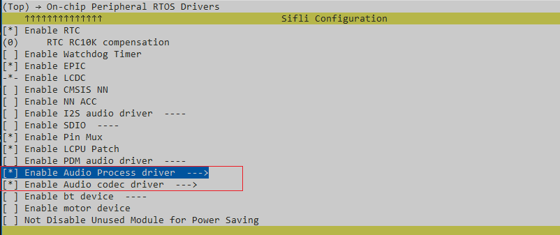
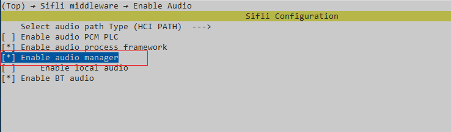
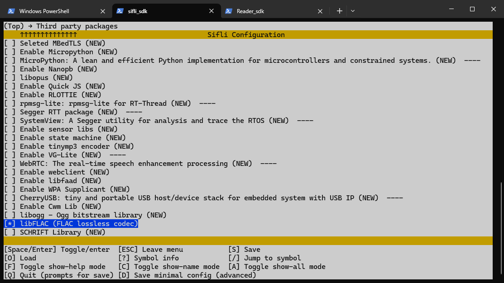

# FLAC示例

源码路径：example/multimedia/audio/flac

## 支持的平台

<!-- 支持哪些板子和芯片平台 -->

- sf32lb52-lcd系列
- sf32lb56-lcd系列
- sf32lb58-lcd系列

## 概述

<!-- 例程简介 -->

- 本示例演示如何使用 FLAC 音频编解码库进行录音、编码、解码和播放，包含：
  - 通过mic录音，从麦克风录制 PCM 音频数据
  - 编码：使用 FLAC 编码器将 PCM 数据压缩
  - 解码：使用 FLAC 解码器解压缩音频数据
  - 播放：将解码后的音频数据通过扬声器播放

## 例程的使用

### 硬件需求

运行该例程前，需要准备：

- 一块本例程支持的开发板（[支持的平台](quick_start)）。
- 喇叭。

### menuconfig配置

1. 本例程需要读写文件，所以需要用到文件系统，配置`FAT`文件系统：


```{tip}
mnt_init 中mount root分区。
```

2. 使能AUDIO CODEC 和 AUDIO PROC：



3. 使能AUDIO


4. 使能AUDIO MANAGER



5. 使能LIB FLAC



### 编译和烧录

切换到例程project目录，运行scons命令执行编译：

```c
> scons --board=sf32lb52-lcd_a128r16 -j16
```

切换到例程`project/build_xx`目录，运行`uart_download.bat`，按提示选择端口即可进行下载：

```c
$ ./uart_download.bat

     Uart Download

please input the serial port num:5
```

关于编译、下载的详细步骤，请参考[快速上手](quick_start)的相关介绍。

## 例程的预期结果

例程启动后：

手动命令：

- flac_test       : 默认录音10秒到/mic_record.pcm，编码解码后播放，也可以自己设置录音时长，如：            						flac_test 5（录音5s）
- flac_enc        : 从/mic_record.pcm读取 PCM 数据，编码为/test.flac
- flac_play       : 将/test.flac进行解码并播放

## 异常诊断

## 参考文档

## 更新记录

| 版本  | 日期    | 发布说明 |
| :---- | :------ | :------- |
| 0.0.1 | 04/2026 | 初始版本 |
|       |         |          |
|       |         |          |