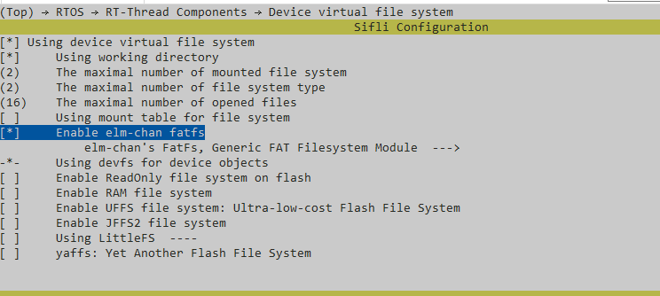

# Opus Example

Source: example/multimedia/audio/opus

## Supported Platforms

- eh-lb525

## Overview

This example demonstrates how to use the Opus audio codec library to record, encode, decode, and play audio. The example includes:

- Recording PCM audio from a microphone at 16 kHz sample rate
- Encoding: compressing PCM frames with the Opus encoder (10 ms frames, ~16 kbps)
- Decoding: decompressing Opus-encoded audio with the Opus decoder
- Playback: outputting decoded PCM to the speaker

## Usage

### Hardware Requirements

Before running the example, prepare:

- A supported development board (see quick_start)
- A speaker

### menuconfig Settings

1. This example reads and writes files, so enable the FAT filesystem:


     Note: the root partition is mounted in `mnt_init`.

2. Enable AUDIO CODEC and AUDIO PROC:

3. Enable AUDIO (`AUDIO`):

4. Enable the Audio Manager (`AUDIO_USING_MANAGER`):


### Notes

If `opus_test()` calls `opus_encoder_ctl(encoder, OPUS_SET_FORCE_MODE(MODE_SILK_ONLY));`, set `OPUS_STACK_SIZE` to 20k.
If it does not call that function, set `OPUS_STACK_SIZE` to 200k.

### Build and Flash

From the example project directory, build with scons:

```
scons --board=eh-lb525 -j32
```

Then go to the example `project/build_xx` directory and run `uart_download.bat`. Choose the serial port when prompted to flash:

```
./uart_download.bat

Uart Download
please input the serial port num:5
```

For detailed build and flash steps, see quick_start.

## Expected Behavior

Automatic: On startup the program records 10 seconds from the microphone, encodes and decodes the audio, then plays it back.

Manual commands:
- `opus` — record 10 seconds to /mic16k.pcm, then encode/decode and play
- `opus /mic16k.pcm` — read PCM from the specified file, then encode/decode and play
- `opus xxxxx` — if the file does not exist, record and loopback in real time for 10 seconds (record and play simultaneously)

## Troubleshooting

(No specific diagnostics provided.)

## References

For RT-Thread device examples, refer to the RT-Thread documentation (for example, see the RTC documentation on the RT-Thread website).

## Revision History

| Version | Date | Notes |
|:---|:---|:---|
| 0.0.1 | 12/2025 | Initial release |

