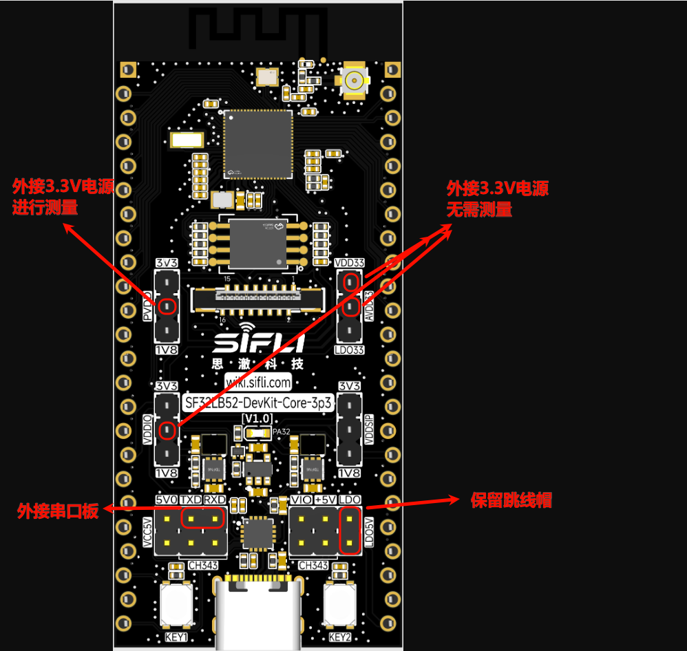

# 屏幕刷新场景功耗测试示例

源码路径: example/pm/lcd_refresh

## 概述
本例程用于测试芯片在屏幕刷新（LCD Refresh）持续工作场景下的功耗表现。

### 支持的开发板
此示例支持在以下开发板上运行：
- sf32lb52-core_n16r16

## 功耗测试环境准备
按照如图方式进行供电，供电的针脚如图框出，其余跳线帽全部去除，保留LDO5V的跳线帽，TXD与RXD外接串口板用来输入命令



### 编译和烧录
以sf32lb52-core_n16r16为例，切换到例程 `project/` 目录，运行 `scons` 命令执行编译：
```bash
scons --board=sf32lb52-core_n16r16 -j8
```
烧录：
```bash
build_sf32lb52-core_n16r16_hcpu\uart_download.bat
```
### 例程输出期望
烧录复位后系统启动，屏幕上出现 `200 * 228` 尺寸红绿交替刷屏闪烁即代表程序正常运行，此时在功耗仪记录的波形将是一段平稳的 16ms 周期性刷屏的波形


## 测试数据（PVDD）
条件：16 ms 刷新一帧

| 项目 | 时间 | 电流 | 
|---:|---:|---:|
| 填充  | 930 µs | 10.2 mA  |
| 送屏 | 15.6 ms | 3.22 mA |

下面为按 16.5 ms 周期的增量电流计算:

| 项目 | 计算 | 增量电流 |
|---:|---:|---:|
| 填充 930 µs 的增量 | 930 µs * 10.2 mA / 16.5 ms | 0.57 mA |
| 送屏 15.6 ms 的增量 | 15.6 ms * 3.22 mA / 16.5 ms | 3.04 mA |

合计0.57 mA + 3.04 mA = 3.61 mA


