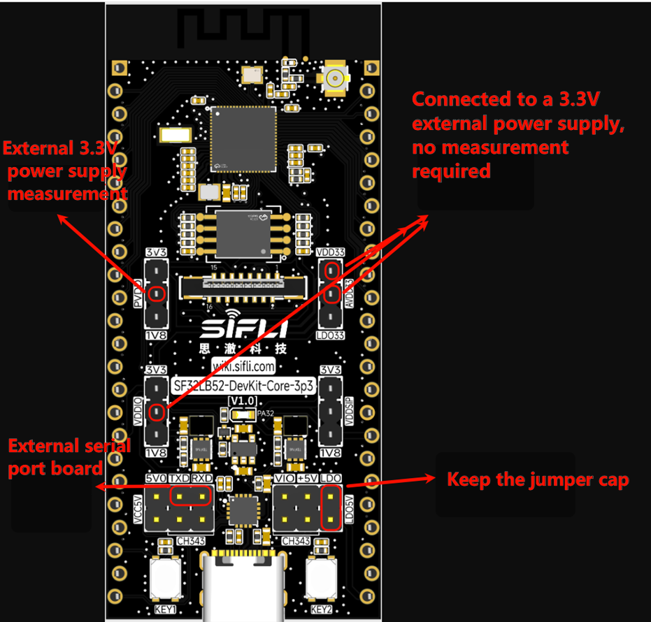
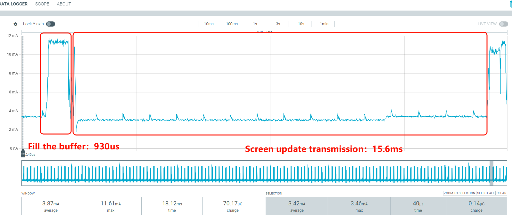

# Power Consumption Test Example — Screen Refresh Scenario

Source path: example/pm/lcd_refresh

## Overview
This example measures the chip's power consumption behavior during continuous LCD refresh activity.

### Supported boards
- sf32lb52-core_n16r16

## Power measurement setup
Power the board as shown in the illustration; the supply pins are highlighted. Remove other jumper caps and keep the LDO5V jumper cap installed. Connect TXD and RXD to a serial adapter for input and control.


### Build and flash
Example (sf32lb52-core_n16r16): change to the example's `project/` directory and build with SCons:
```bash
scons --board=sf32lb52-core_n16r16 -j8
```
Flash using the provided batch script:
```bash
build_sf32lb52-core_n16r16_hcpu\uart_download.bat
```

### Expected runtime behavior
After flashing and reset the system boots and the display shows a 200 × 228 alternating red/green flicker. On the power meter you should see a stable, periodic waveform with a ~16 ms refresh period.


## Test data (PVDD)
Condition: 16 ms per-frame refresh

| Item | Duration | Current |
|---:|---:|---:|
| Fill (buffer) | 930 µs | 10.2 mA |
| Submit / Display | 15.6 ms | 3.22 mA |

Below are the delta-current calculations normalized to a 16.5 ms period:

| Item | Calculation | Delta current |
|---:|---:|---:|
| Delta for 930 µs fill | 930 µs * 10.2 mA / 16.5 ms | 0.57 mA |
| Delta for 15.6 ms submit | 15.6 ms * 3.22 mA / 16.5 ms | 3.04 mA |

Total: 0.57 mA + 3.04 mA = 3.61 mA


