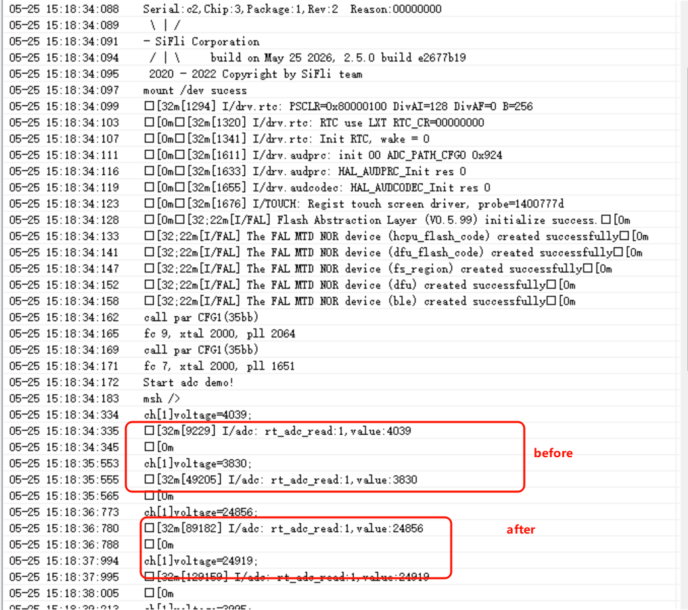
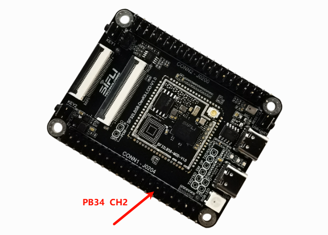
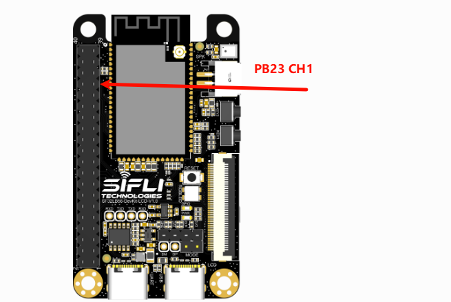
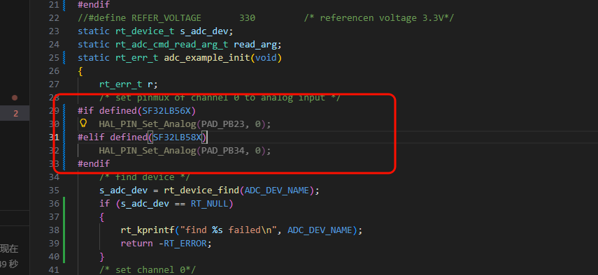

# ADC_battery Example
Source code path: example/rt_device/adc/adc_battery
## Supported Platforms
The example can run on the following development board series.
+ sf32lb52-lcd series
+ sf32lb56-lcd series
+ sf32lb58-lcd series

## Overview
* Under the RT-Thread operating system, this example uses single-channel ADC sampling to read the VBAT battery voltage.

## Usage
### Build and Flash
* This example uses ADC. Under RT-Thread, the ADC peripheral is virtualized as an rt_device for read and write operations. Make sure the `rtconfig.h` file in the current path contains the following macros:

```c
#define BSP_USING_ADC 1
#define BSP_USING_ADC1 1
#define RT_USING_ADC 1
```

Only when these three macros are present will `sifli_adc_init` register the `bat1` rt_device through `rt_hw_adc_register`, allowing `rt_device_find` and `rt_device_control` to succeed later.<br>
**Note**<br>
SiFli MCUs support timer interrupts to trigger simultaneous multi-channel sampling. Refer to the `BSP_GPADC_SUPPORT_MULTI_CH_SAMPLING` macro definition and the chip user manual.
* If any of the three macros are missing, enable them with `menuconfig` using the following command:

> sdk.py menuconfig --board=sf32lb52-lcd_n16r8       525 development board

> sdk.py menuconfig --board=sf32lb52-lcd_52d       52d development board

As shown below, select GPADC1, save and exit `menuconfig`, then check whether the `rtconfig.h` macros were generated.

* Switch to the example project directory and run the `scons` command to build:

```
scons --board=sf32lb52-lcd_n16r8 -j8
```

* Run `build_sf32lb52-lcd_n16r8_hcpu\uart_download.bat` and follow the prompts to select the serial port for download:

```
build_sf32lb52-lcd_52d_hcpu\uart_download.bat

Uart Download

please input the serial port num:5
```

#### Example Output:
The measured voltage is printed once per second in a loop.

* Comparison of the voltage log before and after connecting the battery



* Measurement test points for the 58_lcd and 56_lcd boards:

58 test points:



56 test points:




#### ADC Configuration Flow

* Set the channel corresponding to the VBAT interface according to your board platform. This example uses channel 7 for the 52 series.


* Set the ADC channel pin you want to measure to analog input mode (except channel 7 on the 52-series platform)



**Note**  
1. ADC input pins are fixed IOs, as shown below:<br>The 52 series ADC CH1-7 mapping corresponds to software channels 0-6. The last channel, CH8 (Channel 7), is internally connected to VBAT sensing and is not mapped to an external IO.<br>

1. For `HAL_PIN_Set` and `HAL_PIN_Set_Analog`, the last parameter selects HCPU or LCPU: 1 for HCPU, 0 for LCPU.<br>


* Use `rt_device_find` and `rt_device_control` to locate and configure the `bat1` device interface in sequence.
`rt_adc_ops` does not define `rt_device_open`, so skipping `rt_device_open` will not affect ADC functionality. It only affects whether `bat1` appears as opened in `list_device`.
```c
#define ADC_DEV_NAME        "bat1"      /* ADC1 device, already registered in rt_hw_adc_register, do not change arbitrarily */
#define ADC_DEV_CHANNEL     7           /* ADC channel selection, VBAT is fixed to CH8 (Channel 7) */
//#define REFER_VOLTAGE       330         /* ADC reference voltage, the 52 series can select 1.8 V or 3.3 V, but the interface is not exposed and is fixed at 3.3 V */
static rt_device_t s_adc_dev; /* Define an rt_device handle */
static rt_adc_cmd_read_arg_t read_arg;

void adc_example(void)
{
    rt_err_t r;

    /* Configure PA28 as analog input IO and do not enable internal pull-up or pull-down resistors */
    //HAL_PIN_Set_Analog(PAD_PA28, 1);

    /* Find the bat1 device. If BSP_USING_ADC1 is not enabled, the device will not be found and the system will hang */
    s_adc_dev = rt_device_find(ADC_DEV_NAME);

    /* Configure the sampling channel */
    read_arg.channel = ADC_DEV_CHANNEL;

    r = rt_adc_enable((rt_adc_device_t)s_adc_dev, read_arg.channel);
    
    /* This interface calls the sifli_adc_control function and reads only once. Users can process the data themselves. */   
    r = rt_device_control(s_adc_dev, RT_ADC_CMD_READ, &read_arg.channel);
    /* The logged value is in 0.1 mV units. 20846 means 2084.6 mV, or 2.0846 V. */
    LOG_I("adc channel:%d,value:%d",read_arg.channel,read_arg.value); /* (0.1mV), 20846 is 2084.6mV or 2.0846V */

    /* This demonstrates another way to perform ADC sampling. This interface calls sifli_get_adc_value and performs the default 22-sample average. */
    rt_uint32_t value = rt_adc_read((rt_adc_device_t)s_adc_dev, ADC_DEV_CHANNEL);
    /* The logged value is also in 0.1 mV units. 20700 means 2070.0 mV, or 2.0700 V. */
    LOG_I("rt_adc_read:%d,value:%d",read_arg.channel,value); /* (0.1mV), 20700 is 2070mV or 2.070V */

    /* Disable the ADC after sampling */
    rt_adc_disable((rt_adc_device_t)s_adc_dev, read_arg.channel);

}
```


## Troubleshooting
* The program crashes and prints the following log:
```c
   Start adc demo!
   Assertion failed at function:rt_adc_enable, line number:144 ,(dev)
   Previous ISR enable 0
```
Reason:  
`BSP_USING_ADC1` is not defined, so `rt_hw_adc_register` does not register `bat1`. As a result, `rt_device_find` triggers an assertion failure when looking up the device.  
Make sure the `rtconfig.h` file contains the following three macros:
```c
#define BSP_USING_ADC 1
#define BSP_USING_ADC1 1
#define RT_USING_ADC 1
```
* The sampled ADC voltage is incorrect

1. Use the `list_device` command to check whether the `bat1` device exists. The ADC driver is not affected even if `bat1` is not opened with `rt_device_open`.
```
    msh />
 TX:list_device
    list_device
    device           type         ref count
    -------- -------------------- ----------
    audcodec Sound Device         0       
    audprc   Sound Device         0       
    rtc      RTC                  0       
    pwm3     Miscellaneous Device 0       
    pwm2     Miscellaneous Device 0       
    touch    Graphic Device       0       
    lcdlight Character Device     0       
    lcd      Graphic Device       0       
    bat1     Miscellaneous Device 0       
    i2c4     I2C Bus              0       
    i2c1     I2C Bus              0       
    spi1     SPI Bus              0       
    lptim1   Timer Device         0       
    btim1    Timer Device         0       
    gptim1   Timer Device         0       
    uart2    Character Device     0       
    uart1    Character Device     2       
    pin      Miscellaneous Device 0       
    msh />
```
2. Check whether the ADC hardware is connected correctly. ADC sampling channels map to fixed IO pins and cannot be assigned arbitrarily. Refer to the chip manual for the CH0-7 pin mapping.
3. The ADC input voltage range is 0 V to the reference voltage (3.3 V by default on the 52 series). Do not exceed the input range.
* ADC accuracy is insufficient
1. Check whether ADC calibration parameters are obtained and applied.
2. Check whether the voltage divider resistor accuracy meets the requirement.
3. Check whether the ADC reference voltage is stable and has excessive ripple. Refer to the ADC reference documentation in the chip manual for details.


## Reference Documents
* EH-SF32LB52X_Pin_config_V1.3.0_20231110.xlsx
* DS0052-SF32LB52x Chip Technical Specification V0p3.pdf
* [RT-Thread Official Website](https://www.rt-thread.org/document/site/#/rt-thread-version/rt-thread-standard/programming-manual/device/adc/adc)<br>
https://www.rt-thread.org/document/site/#/rt-thread-version/rt-thread-standard/programming-manual/device/adc/adc
## Revision History
|Version |Date   |Release Notes |
|:---|:---|:---|
|0.0.1 |11/2024 |Initial version |
|0.0.2 |05/2026 |Added notes for 56 and 58 |
| | | |
