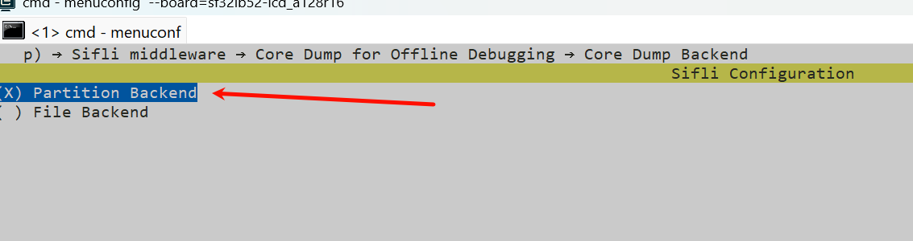
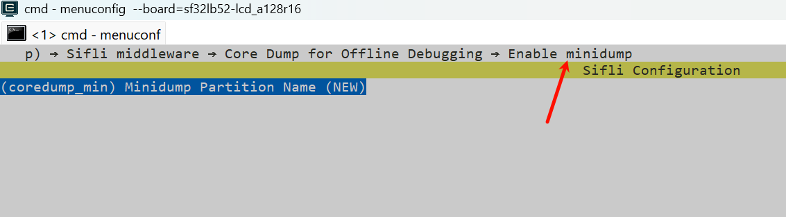
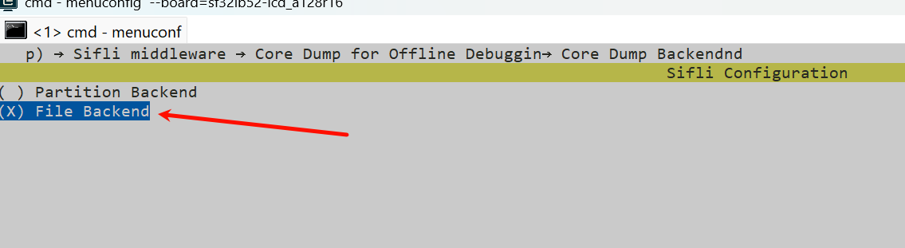
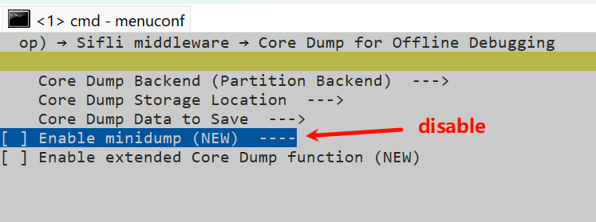
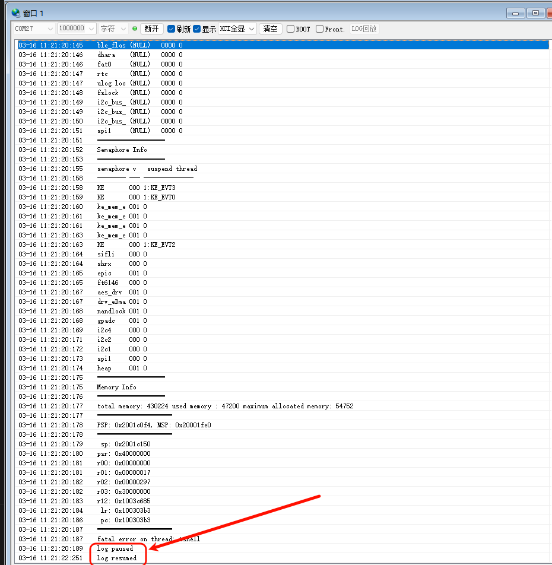
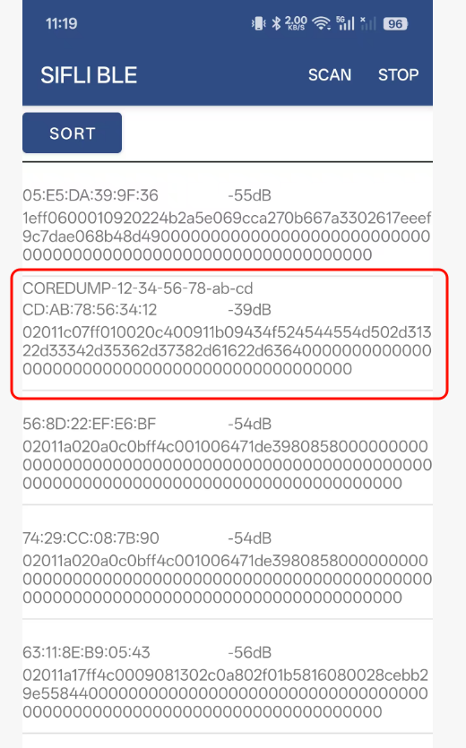
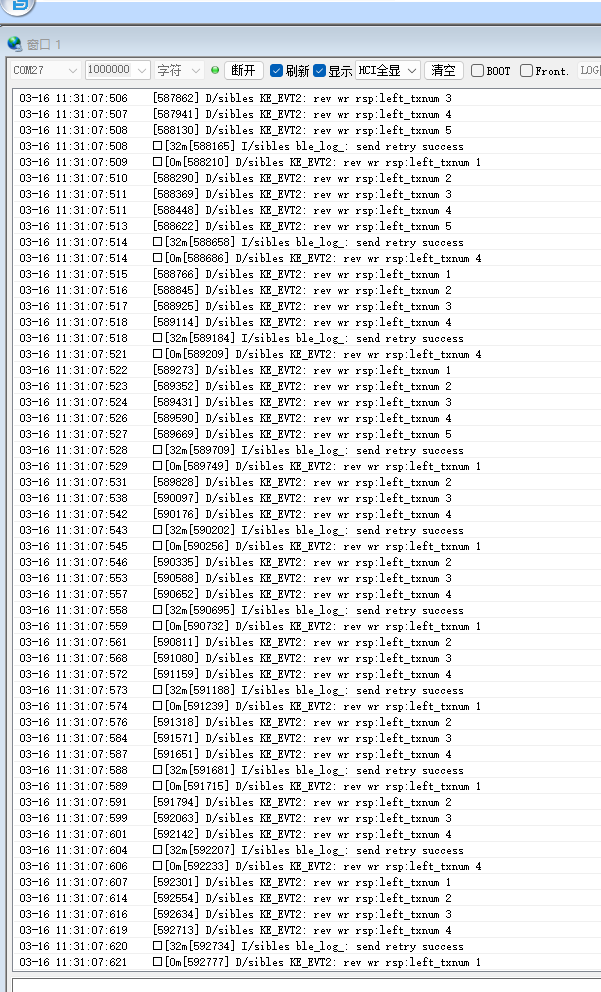

# Coredump Example
Source path: `example/system/coredump`

## Overview
- This example demonstrates how to save crash information. It also supports connecting to a mobile phone over BLE and transferring crash context data. After power-on, the device broadcasts with a name like `COREDUMP-xx-xx-xx-xx-xx-xx`.

## Supported Platforms
Verified on the following platforms:
- `sf32lb52-lcd_n16r8`
- `sf32lb52-lcd_a128r16`

## Configuration and menuconfig
This example supports four mode combinations:
1) Partition mode, minidump disabled
2) Partition mode, minidump enabled
3) File mode, minidump disabled
4) File mode, minidump enabled

The default is mode 1 (Partition mode, minidump disabled). You can switch modes using the following settings.

2) Partition mode, minidump enabled



3) File mode, minidump disabled



4) File mode, minidump enabled


### Build and Flash
Using `sf32lb52-lcd_n16r8` as an example, follow these steps to build and flash:
```
scons --board=sf32lb52-lcd_n16r8

.\build_sf32lb52-lcd_n16r8_hcpu\uart_download.bat
```

## How to Use
After power-on, when a crash occurs (you can manually trigger a crash with `assert`), logs like the following indicate that crash context data has been saved:


Reset the board, then open the SiFli BLE app on your phone. Find and connect to the Bluetooth device named like `COREDUMP-xx-xx-xx-xx-xx-xx`, then export the crash context data in the app:


During export, a large amount of corresponding logs will appear:


Finally, a `.bin` file is generated on the phone. Send this file to your PC and use `Context2Mem.exe` to convert the `.bin` file into a dump file:
http://docs.sifli.cc/test_doc/methods/%E6%95%B4%E6%9C%BAlog%E5%AF%BC%E5%87%BA%E4%B8%8E%E8%BD%AC%E6%8D%A2.html

